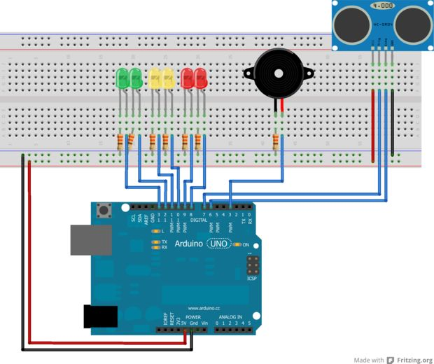

===========
Experiment
===========

The Idea
=========

The inspiration for this experiment came from car backup sensors. These use several small devices placed around the exterior of the car that emit ultrasonic pulses to determine the distance of potential obstacles. Our idea was to try and re-create something similar using an arduino and a few peripheral accessories. 

Board Setup
============

The board is generally setup according to the diagram below:

It consists of an arduino connected to a breadboard, which holds three LEDs (red, yellow, green), an ultrasonic senosr, and a piezo buzzer.

Function
=========

