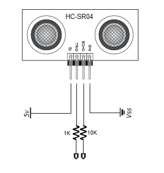
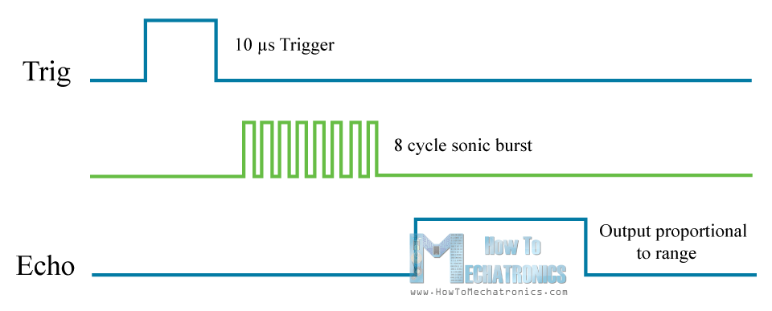
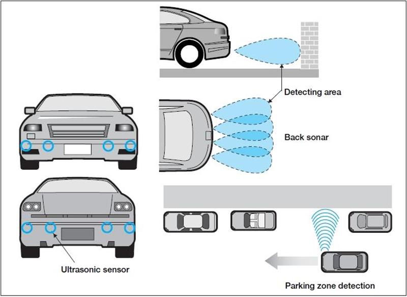

The Test Device
================

===================================
HC-SR04 Ultrasonic Sensor
===================================

Pins:

* 5V Supply
* Echo pulse output
* Trigger pulse input
* 0V 

Cycle:

* 1. Using IO trigger for at least 10us high level signal
* 2. The Module automatically sends eight 40 kHz and detect whether there is a pulse signal back. 
* 3. If the signal is read, the time of high output IO duration is the time from sending ultrasonic to returning. 

In order to generate the ultrasound you need to set the Trig on a High State for 10 µs. That will send out an 8 cycle sonic burst which will travel at the speed sound and it will be received in the Echo pin. The Echo pin will output the time in microseconds the sound wave traveled.

The ultrasonic distance sensor can be used in a wide variety of applications. Many people utilize the sensor to build projects that can move around and avoid obstacles, accurately measure distances, and notify about incoming objects.

Car backup sensors and high-end side mirrors use ultrasonic sensors to notifiy of nearby cars and objects. Sound waves above 20kHz (well above human hearing) are sent out in pulses and then the reflection of these pulses are timed and then used to measure distances. Sometimes these pulses are in excess of 100dB to ensure clear reception (wow!). 

`reference <http://www.newelectronics.co.uk/electronics-technology/an-introduction-to-ultrasonic-sensors-for-vehicle-parking/24966/>`_

