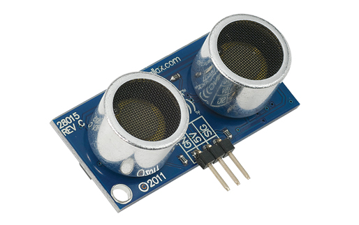
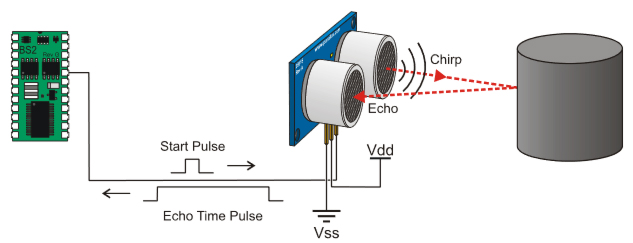
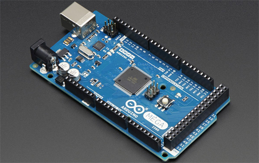

===========================================
COSC 2325-001 Spring 2017 Group Project #2
===========================================

John Bradshaw, Michael Scales, Matthew Wiederaenders, Nicholas Moore

PING))) Ultrasonic Distance Sensor 
===================================

The PING))) sensor works by transmitting an ultrasonic burst and providing an output pulse that corresponds to the time required for the burst echo to return to the
sensor. By measuring the echo pulse width, the distance to target can easily be calculated. 

Features:

* Provides precise, non-contact distance measurements within a 2 cm to 3 m range
* Simple pulse in/pulse out communication requires just one I/O pin
* 3-pin header makes it easy to connect to any development board such as the breadboard we are using in class

Details: 

* Range: approximately 1 inch to 10 feet (2 cm to 3 m)
* 3-pin male header with 0.1" spacing
* Power requirements: +5 VDC; 35 mA active
* Dimensions: 0.81 x 1.8 x 0.6 in (22 x 46 x 16 mm)

Arduino MEGA 2560
==================

Features:

* Microcontroller board based on the ATmega2560
* 54 digital input/output pins
* 16 analog inputs
* Open-source Arduino IDE software for coding

Details:

* The Mega 2560 can be powered via the USB connection or with an external power supply
* 256 KB of flash memory for storing code
* 8 KB of SRAM and 4 KB of EEPROM 
* 16 MHz crystal oscillator

